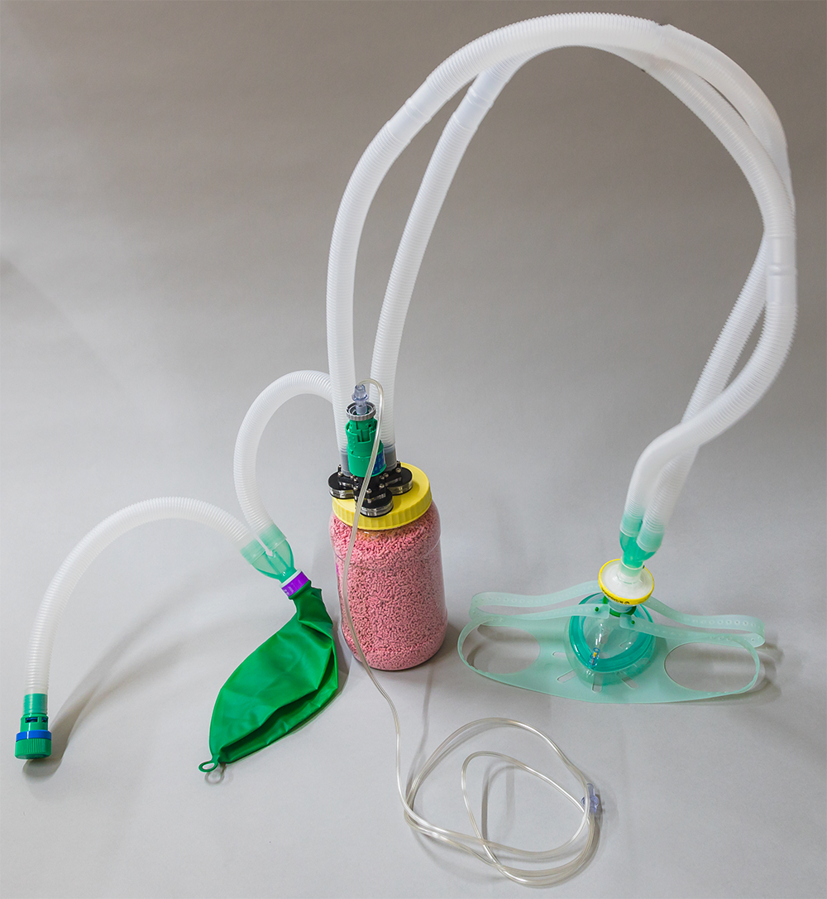

# How to contribute to this project? 

We urge you to contribute and make the published designs better. You can fork this project(Learn [here](https://www.youtube.com/watch?v=_NrSWLQsDL4)) and create a copy of this project. Now create a new folder on the *Hardware Designs* folder with the latest version number. 

The versioning scheme (**vX.Y**) is as follows: 

v1.0 --> Original Design 

For major modifications to a particular design, increment X by 1 (eg. v2.0, v3.0). If you make a minor edit to a particular design, increment Y by 1, from the base design you modified (eg. v1.2, v1.4, v2.3). 
In this new folder, make sure you have the following files and folders (For reference check the original v1.0 folder) 
- *Hardware Parts Explained.pdf* --> Explaining each and very part of your design with pictures 
- *Assembly Steps.pdf* --> Detailed steps on how you will put this together 
- *Bill of Materials* --> Bill of materials file containing the parts to be purchased/3D printed/Lasercut/moulded 
- *Mechanical CAD Folder* --> Containing editable files for the community along with the 3D printed files(if any) 
- *ReadMe.md* file --> Detailing the changes made and why you think it is better. Add a picture of the full setup. List potential issues you find in the version you build so that others can help suggest improvements. 

Once the folder along with the above contents are made. Add the final picture of your setup to the this ReadMe file towards the end in the Hardware Designs folder with your version number so that someone can find the full design evolution in one page. 

Please submit a [pull request](https://docs.github.com/en/github/collaborating-with-issues-and-pull-requests/about-pull-requests) with your changes. We will review the changes and add to the Github project page.

# Different Designs

### ***v1.0***

