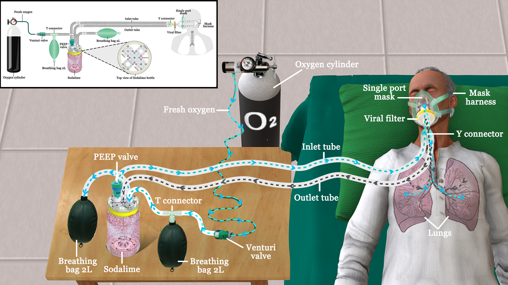

# Overview

There is currently an acute shortage of medical grade oxygen in large parts of the country, as a consequence of a big surge in the number of critical Covid-19 cases, as well as logistical challenges associated with the oxygen supply chain. Several past and current students and research staff members of  [IIT Bombay](https://www.iitb.ac.in) (affiliated with [Tata Centre for Technology and Design](http://www.tatacentre.iitb.ac.in/), [Chemical Engineering](https://www.che.iitb.ac.in), and [Nex Robotics](http://www.nex-robotics.com)) have come together to attempt solutions which focus on reducing O2 wastage, from the patient consumption perspective.

We have built a prototype breathing device called reBreather, which can minimize the wastage of oxygen when a patient is put on assisted breathing with supplemental oxygen via O2 cylinders or centralised O2 supply in hospitals.  Our reBreather prototype is a semi-closed circular breathing system that would allow patients to breathe in unused exhaled oxygen which has been filtered to remove CO2.

The hardware design is available in the public domain under the Creative Commons 4.0 license ([CC BY-SA 4.0](https://creativecommons.org/licenses/by-sa/4.0/)) so that others can replicate the design. We urge individuals and makers communities across the world to come forward and 
1. help assemble copies of the prototype, and 
2. contribute design improvements or customizations, including for better scalability. 

This design has currently been tested on healthy volunteers: our objective in releasing this design now is to document the science behind the technique and test that it works in a practical context, and potentially help mitigate wastage of O2 at a time when there is a heavy demand for it.

We have added explanations on how the reBreather works and on how to build a unit, with detailed pictures and instructions. Vendor and pricing details of the parts we have used in this design have also been provided. We have sourced these with relative ease in Mumbai; you may find cheaper - and better - alternatives for these items. Feel free to let us know if there are ways by which you can help us in improving the design or documentation, or with better vendor connections.  

# ⚠️ Disclaimers

We make no representation as to the operability and in particular, the fitness, safety, and efficacy of this solution. This prototype has been designed with inputs from experts with Anesthesiology and Intensive Care backgrounds, but at this time has only been informally tested on healthy volunteers. It has not been clinically tested in a controlled fashion and approved for routine use. We release this design into the public domain with the intent of encouraging further research and testing, towards improving the design. We strongly recommend the following:

- This prototype should only be tested and used under the close supervision of a trained medical professional, familiar with methods of alleviating respiratory distress.
- Flow settings should be modulated by systematic monitoring over time, by a professional, of a patient's FiO2 (fraction of inspired oxygen), CO2 percentage, and the effort of breathing.
- The prototype relies on the soda lime changing colour as its CO2 absorption capacity is exhausted; its appearance must be frequently monitored, and the exhausted absorbent replaced with fresh soda lime in a timely fashion. 

# How does reBreather work?

In a normal open-loop oxygen-breathing system, a mask is directly connected to the oxygen supply at a particular flow rate. During inhalation, the human respiratory system takes in this oxygen stream, in some cases along with atmospheric air. In the exhalation cycle, the person breathes out unutilized gases as well as the CO2 generated as a by-product of metabolism. A healthy person normally breathes in 5 liters per minute (L/min) of air. This corresponds (assuming air has ~20% O2) to about 1 L/min of O2 being inhaled; of this, ~0.25 L/min of O2 is consumed.  Critically ill Covid-19 patients can receive up to 50 L/min of O2 using a high-flow nasal cannula and mask combination. Consequently, during one open loop breathing cycle for such patients, most of the oxygen is lost back to the atmosphere.

A rebreather is a closed (or semi-closed) loop system that helps the user to rebreathe the unused oxygen that they have just exhaled. To do this, rebreathers have a section that helps remove the CO2 in the exhaled air thereby preventing an increase in the CO2 concentration in the closed-loop system. The amount of oxygen absorbed by the user is replenished by a fresh supply of oxygen into the closed-loop. This concept has extensively been used in underwater diving breathing devices. Those designs are significantly more complex in practice, however, and have a fully closed loop system with air sensors measuring concentrations of O2 and adjusting the input oxygen flow accordingly.

It will be beneficial to recirculate the unused oxygen, especially when the latter is in short supply.  Releasing a lot of oxygen results in the oxygen concentration going up, especially in closed spaces.  This could be a reason for the increased fire incidence in hospitals, during the current pandemic.  The solution presented in this work is an attempt to address this problem, as explained next.

Our solution (called reBreather) is a semi-closed circular breathing system. We have an inlet section which pumps in fresh oxygen from an oxygen cylinder or a centralised oxygen system in hospitals. The oxygen flow rate is set on the cylinder with a flow meter. An adjustable venturi valve is given at the input to allow for external air to be automatically pulled in based on the desired oxygen flow rate. A one port mask is attached to the patient; it has a Y connector which connects to a bacterial/viral filter at one end. At the other end, the Y connector has an inlet for incoming air and an outlet for exhaled air. Flow directions are regulated by using one-directional valves.  The exhaled air is fed to a container which contains medical-grade soda lime which selectively absorbs CO2 and allows the rest of the air to pass through to the inlet section of our system.

Medical grade soda lime changes colour once it has exhausted its capability to absorb CO2. There are different indicator dyes in use, with colour change combinations varying across manufacturers and brands (for example, pink (fresh) to white (exhausted), or white (fresh) to violet (exhausted), etc.). It is important to note that a soda lime colour change must be promptly attended to: at this time we recommend that it be replaced with a fresh batch of soda lime towards continuous use of the device: an elevation in the CO2 concentration in the rebreather circuit would be harmful to the patient.

Approximate calculations of unit performance are provided below for various scenarios. These are O2 utilization estimates for a single patient, and assuming that a cylinder holds 7800 L of pure O2. The closed loop design assumes 10% purge of the recirculating stream, per cycle, with an equivalent introduction of fresh O2. Units are in cylinders/day.(Detailed calculations are available in a separate [pdf file](./assets/Estimated_Oxygen_Savings.pdf)).

| Scenario / cylinders per patient per day                                       | Open loop  | Closed loop  with reBreather |
|------------------------------------------------|:----------:|:----------------------------:|
| Nasal Cannula 6 L/min O2 | 1.1 | 0.28 |
| Nonrebreathing mask (NRM), 15 L/min O2 | 2.8 | 0.44 |
| High Flow Nasal Cannula (HFNC), 50 L/min O2 | 9.2 | 1.09 |

# FAQs

1. Can I build this device based on the parts mentioned? \
Yes, you can. However, (as explained above) it should be used solely under the supervision of a trained medical professional. 

2. Is the design open source? \
Yes. The entire hardware design is made available in the public domain under a Creative Commons 4.0 license [(CC BY-SA 4.0)](https://creativecommons.org/licenses/by-sa/4.0/). This design is accessible on our [GitHub page](https://github.com/TCTD-IIT-Bombay/reBreather). 

3. How can I help? \
You can also help us in testing the design, and by suggesting modifications to further improve its performance and manufacturability. Talk to doctors and give us their inputs. There are several elements in the design which can be further optimised. Our primary focus during this initial build cycle has been on establishing efficacy of the design. We have, to a lesser extent, focussed on incorporating off the shelf branded parts which we think anyone else would also be able to source locally. Feel free to fork the project, edit it and create pull requests if you have a way to make the design better or have an alternate design which will work.
You can also help us (and others) by finding better vendor sources in your city.     

4. What is the current status of the project?  \
(As of May 15 2021:) We are releasing version v1.0 of the reBreather prototype design. This design has been tested on a healthy team member who was hooked up to a patient monitoring device, under the supervision of clinical specialists.  His vital signs, breathing rate, inhalation & exhalation O2 /CO2  levels were monitored. \
At a low O2  input flow rate of 1 L/min, the volunteer was able to maintain normal breathing patterns with O2  and CO2  levels well within limits. We were able to establish that CO2  is continuously being removed from the system. \
There are further modifications that we are working on to make the designs better and easier to manufacture. We will keep updating the Hardware design folder with design variations as and when these changes are introduced. We are also working on protocols to safely regenerate soda lime for reuse; we will share our results on this effort, shortly.

5. How can I add modifications to the design? \
We urge you to contribute back any design updates. You can fork this  project (learn how to do so [here](https://www.youtube.com/watch?v=_NrSWLQsDL4)) and create a copy. Now create a new subfolder inside the Hardware Designs folder with the latest version number. The versioning scheme (**vX.Y**) is as follows: \
v1.0 --> Original Design \
For major modifications to a particular design, increment X by 1 (eg. v2.0, v3.0). If you make a minor edit to a particular design, increment Y by 1, from the base design you modified (eg. v1.2, v1.4, v2.3).\
In this new folder, make sure you have the following files and folders (For reference check the original v1.0 folder) 
- *Hardware Parts Explained.pdf* --> Explaining each and very part of your design with pictures 
- *Assembly Steps.pdf* --> Detailed steps on how you will put this together 
- *Bill of Materials* --> Bill of materials file containing the parts to be purchased/3D printed/Lasercut/moulded 
- *Mechanical CAD Folder* --> Containing editable files for the community along with the 3D printed files(if any)\
Detailing the changes made and why you think it is better. Add a picture of the full setup. List potential issues you find in the version you build so that others can help suggest improvements. 
Once the folder along with the above contents are made. Add the final picture of your setup to the main ReadMe file in the Hardware Designs folder with your version number so that someone can find the full design evolution in one page. \
Please submit a [pull request](https://docs.github.com/en/github/collaborating-with-issues-and-pull-requests/about-pull-requests) with your changes. We will review the changes and add to the Github project page.
6. How can I contact the team?  \
Drop us a mail at rebreather@tctd.iitb.ac.in
